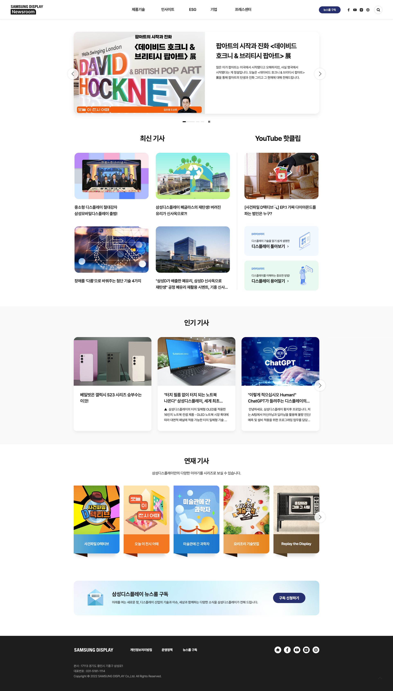

  <h1>Samsung Display Newsroom Clone Coding</h1>
     
  
  
<!-- Badges -->
<!-- Screenshots -->

 
  

  

<h4>
  <a href="https://heeheepark.github.io/samsung-display-newsroom-clone-coding/">클론코딩사이트</a>
   · 
    <a href="https://heeheepark.notion.site/Samsung-Display-Newsroom-Clone-Coding-Project-b22e3fc211e4451fb5fa5ade3cbab234">Notion</a>
   · 
    <a href="https://www.canva.com/design/DAFi-ZergiY/qP3h7yflt8xPcTJT3mydTQ/view?utm_content=DAFi-ZergiY&utm_campaign=designshare&utm_medium=link&utm_source=publishsharelink">Project발표</a>
   · 
    <a href="https://news.samsungdisplay.com/">원사이트</a>
  </h4>

   

<!-- TechStack -->

## :space_invader: About Team Member

- 박주희(Team Leader)
- 오영지(Team Member)

 

### 담당 영역 및 역할

- 박주희: Github, Notion, Slack 관리 / header, community, hot-news 영역 작업
- 오영지: Github, 발표자료 준비 / card-news, series-news, subscribe, footer 영역 작업

<!-- About the Project -->

## :star2: About the Project

### 작업기간

2023-05-01 ~ 2023-05-17(17일)
  

<!-- Getting Started -->

### 협업 도구

      
  

<!-- Features -->

### 사이트 선정 이유

- 대기업 홈페이지: 대기업 홈페이지라서 오류가 적을 것이라고 생각했고 구조도 잘 짜여져있을 것이라 생각했습니다.
- 반응형 웹사이트: 반응형 작업이 가능했습니다.
- 스와이퍼, 애니메이션(transition) 적용: 수업에서 배운 내용을 적용해볼 수 있을 것이라 생각했습니다.
- 적당한 분량: 2인 작업하기에 적당한 분량이라고 생각했습니다.
    

## :handshake: Contact

- 박주희(Joohee Park, Team leader) : email: pjh9641@gmail.com / Github Link: https://github.com/heeheepark
- 오영지(Yeongji Oh, Team memeber) : email: dev.cappp@gmail.com / Github Link: https://github.com/oh-yeongji
